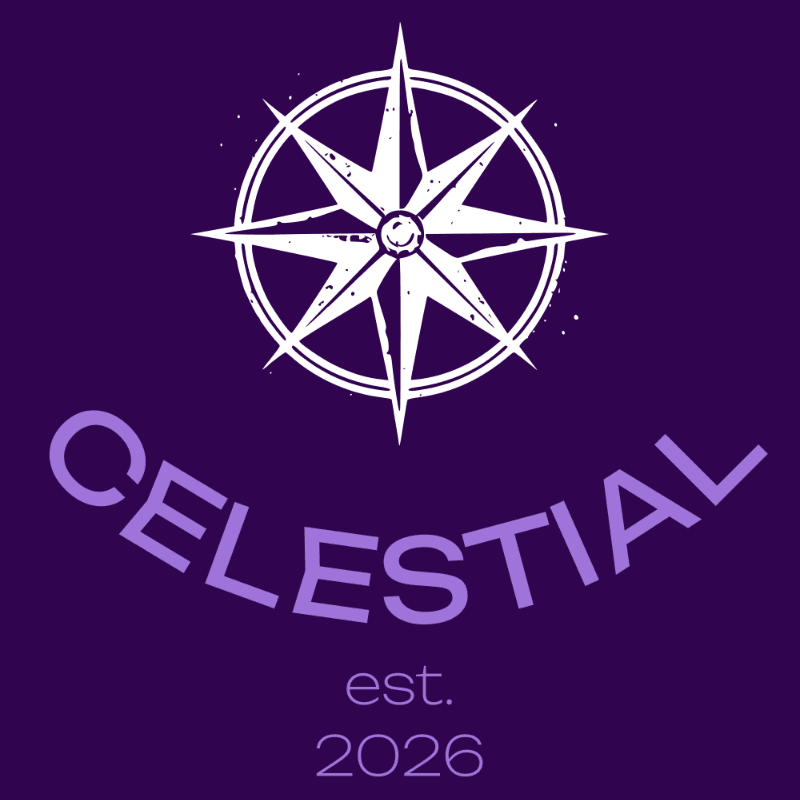

<div align="center">

# 🌌 Celestial — NASA Astronomy Explorer

### Browse NASA's Astronomy Picture of the Day, EPIC Earth photos, and chat with an AI cosmic assistant.

[](https://github.com/Balance312/Celestial-the-Nasa-based-astronomy-website/actions/workflows/ci.yml)
[](https://react.dev/)
[](https://vite.dev/)
[](https://tailwindcss.com/)
[](LICENSE)

<br/>



<br/>

**[✨ View Live Demo →](https://your-app.vercel.app)**&nbsp;&nbsp;•&nbsp;&nbsp;[Report a Bug](https://github.com/Balance312/Celestial-the-Nasa-based-astronomy-website/issues/new?template=bug_report.md)&nbsp;&nbsp;•&nbsp;&nbsp;[Request a Feature](https://github.com/Balance312/Celestial-the-Nasa-based-astronomy-website/issues/new?template=feature_request.md)

</div>

---

## 📋 Table of Contents

- [✨ Features](#-features)
- [🛠️ Tech Stack](#%EF%B8%8F-tech-stack)
- [🚀 Getting Started](#-getting-started)
- [📁 Project Structure](#-project-structure)
- [🔑 NASA API Reference](#-nasa-api-reference)
- [🔒 Security](#-security)
- [🤝 Contributing](#-contributing)
- [📄 License](#-license)

---

## ✨ Features

| Feature | Description |
|---|---|
| 🌠 APOD Dashboard | Today's Astronomy Picture of the Day with full explanation |
| 🌍 EPIC Earth Photos | Browse real satellite images of Earth from NASA's EPIC camera |
| 🤖 AI Cosmic Assistant | Chat with an AI assistant about space and astronomy |
| 🎥 Video Support | Seamlessly embeds NASA video content via iframe |
| 📱 Fully Responsive | Mobile-first design — looks great on any device |
| 🎨 Deep Space Theme | Beautiful purple dark-mode UI inspired by the cosmos |
| ⚡ Fast & Optimized | Vite build tooling with code-splitting and lazy loading |
| 🛡️ Secure API Handling | API keys managed via environment variables, never exposed |

---

## 🛠️ Tech Stack

| Technology | Purpose |
|---|---|
| [React 19](https://react.dev/) | UI component framework |
| [Vite 7](https://vite.dev/) | Build tool & dev server |
| [React Router 7](https://reactrouter.com/) | Client-side routing |
| [Tailwind CSS 4](https://tailwindcss.com/) | Utility-first styling |
| [Headless UI](https://headlessui.com/) | Accessible UI primitives |
| [Heroicons](https://heroicons.com/) | SVG icon library |
| [Bootstrap Icons](https://icons.getbootstrap.com/) | Additional icon set |
| [NASA APIs](https://api.nasa.gov/) | Astronomy data (APOD, EPIC) |
| [Vercel](https://vercel.com/) | Deployment & hosting |

---

## 🚀 Getting Started

### Prerequisites
- Node.js 18+ and npm
- A free [NASA API key](https://api.nasa.gov/)

### 1. Clone & Install

```bash
git clone https://github.com/Balance312/Celestial-the-Nasa-based-astronomy-website.git
cd Celestial-the-Nasa-based-astronomy-website
npm install
```

### 2. Configure Environment Variables

```bash
cp .env.example .env
```

Open `.env` and add your NASA API key:

```
VITE_NASA_API_KEY=your_api_key_here
```

> 💡 Get a free key at [https://api.nasa.gov/](https://api.nasa.gov/) — it takes under 2 minutes.

### 3. Run the Dev Server

```bash
npm run dev
```

Open [http://localhost:5173](http://localhost:5173) in your browser. 🎉

### Other Commands

```bash
npm run build      # Production build
npm run preview    # Preview production build locally
npm run lint       # Run ESLint
npm test           # Run Vitest test suite
```

---

## 📁 Project Structure

```
├── src/
│   ├── App.jsx              # Root app component
│   ├── Router.jsx           # Route definitions
│   ├── main.jsx             # Entry point
│   ├── app.css              # Global styles
│   ├── Components/          # Shared components (Navbar, etc.)
│   ├── pages/               # Page-level components
│   ├── constants/           # App-wide constants & config
│   └── utils/               # Helper utilities
├── api/                     # Vercel serverless API routes
├── public/                  # Static assets
├── images/                  # Image assets
├── docs/                    # Additional documentation
├── .env.example             # Environment variable template
├── vercel.json              # Vercel deployment config
└── vite.config.js           # Vite configuration
```

---

## 🔑 NASA API Reference

This app uses the following NASA APIs (all free with an API key):

| API | Endpoint | Used For |
|---|---|---|
| APOD | `GET /planetary/apod` | Astronomy Picture of the Day |
| EPIC | `GET /EPIC/api/natural` | Earth satellite imagery |

**Common Parameters**

| Parameter | Type | Description |
|---|---|---|
| `api_key` | string | Your NASA API key (required) |
| `date` | YYYY-MM-DD | Specific date (defaults to today) |
| `count` | number | Number of random images |
| `thumbs` | boolean | Return video thumbnail URL |

---

## 🔒 Security

- ✅ API keys stored in `.env` (never committed to git)
- ✅ `.env.example` template provided for contributors
- ✅ Serverless API routes in `/api` proxy sensitive calls
- ❌ Never hardcode API keys in source code

See [SECURITY.md](.github/SECURITY.md) for vulnerability reporting.

---

## 🤝 Contributing

Contributions are welcome! Please read [CONTRIBUTING.md](.github/CONTRIBUTING.md) for guidelines on how to get started, coding standards, and the pull request process.

---

## 📄 License

This project is licensed under the **MIT License** — see the [LICENSE](LICENSE) file for details.

---

<div align="center">
Made with ❤️ and powered by <a href="https://api.nasa.gov/">NASA Open APIs</a>
</div>
